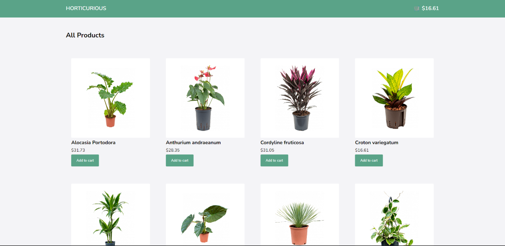

# Horticurious (e-commerce Plant Store)

## Description

A full-stack application using React, Next.js, Hygraph, Apollo client, and snipcart for payment transaction. I wanted to expand my existing knowledge of component-based building with React and incorporate (a) a payment gateway/ cart situation, (b) try to learn more about Next.js, and (c) showcase come great looking tropical plants.   

## Usage

This is only a mock-up e-commerce application, so real services cannot be rendered. Trust me, I wish I had all those plants! You can simply visit the site to explore the gallery of items and build a cart. Please come and take a look [here](https://horticurious-plant-store.vercel.app/). Here's a quick screenshot of the main inventory page.

## License

This application has been created under the MIT license. Please learn on [here](https://github.com/git/git-scm.com/blob/main/MIT-LICENSE.txt)
